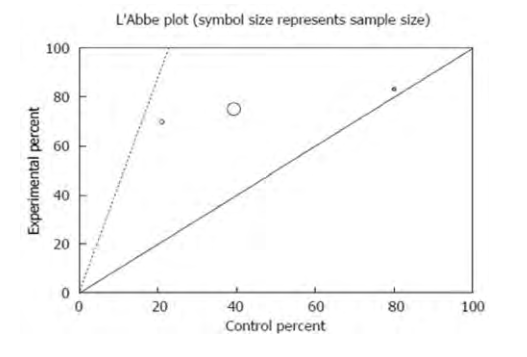
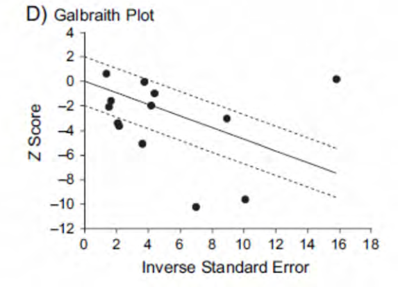
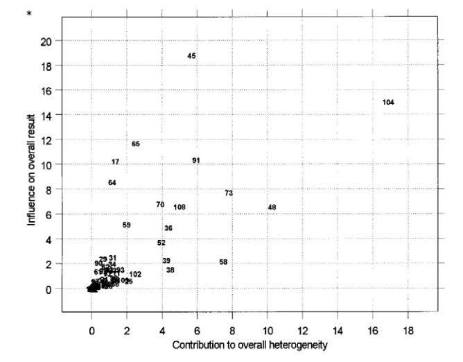

# Part 1: Foundations {background-color="#2c3e50" style="color: white;"}

## What is a Systematic Review?

> A review of the evidence on a clearly formulated question that uses **systematic and explicit methods** to identify, select, and critically appraise relevant primary research, and to extract and analyse data from included studies.

::: {.incremental}
- Uses a **pre-defined protocol** with explicit methods
- Aims to **minimise bias** in identifying, appraising, and synthesising studies
- May or may not include a **meta-analysis** (quantitative synthesis)
- Considered the **highest level** of evidence for clinical decision-making
:::

::: {.notes}
Key distinction: Meta-analysis = statistical synthesis only. It may or may not be part of a systematic review. Chalmers & Altman (1995) clarified this.
:::

## Why Do We Need Systematic Reviews?

::: {.incremental}
- **Keep abreast** of all previous and new research on a topic
- **Introduce** new treatments expected to be better than existing ones
- **Discontinue** outdated, harmful, or less cost-effective treatments
- **Draft guidelines** for health and social interventions
- **Arrive at consensus** where conflicting evidence is reported
:::

::: {.notes}
Emphasise that SR provides the foundation for evidence-based practice guidelines and health policy. Without SRs, we rely on narrative reviews that are prone to researcher bias.
:::

## Narrative Review vs Systematic Review

{fig-align="center" height="520"}

::: {.notes}
Walk through the table row by row. Key contrasts: broad vs focused question, no protocol vs registered protocol, subjective vs explicit selection, 1+ author vs 3+ authors, weeks vs months-years timeline.
:::

## Narrative Review vs Systematic Review (cont.)

| Feature | Narrative Review | Systematic Review |
|---------|-----------------|-------------------|
| **Goal** | Summary or overview | Answer a focused question |
| **Question** | Broad; hypothesis may not be stated | PICO-defined; hypothesis stated |
| **Protocol** | None | Peer-reviewed, registered |
| **Search** | Non-exhaustive, keyword-based | Comprehensive, reproducible |
| **Appraisal** | Variable quality evaluation | Standard checklists (RoB) |
| **Synthesis** | Influenced by reviewer beliefs | Evidence-based, transparent |
| **Timeline** | Weeks to months | Months to years |

# Part 2: Steps in a Systematic Review {background-color="#2c3e50" style="color: white;"}

## Common Stages of a Systematic Review

{fig-align="center" height="520"}

::: {.notes}
This is a flowchart from the book. Walk through each stage: Review initiation -> Question & methodology -> Search strategy -> Study characteristics -> Quality assessment -> Synthesis -> Reporting. Emphasise that stakeholder engagement runs alongside.
:::

## Getting Started: Before You Begin

:::: {.columns}

::: {.column width="50%"}
### Review Team
- Clinical/subject expert
- SR methods expert
- Statistician
- Information specialist/librarian
- Health economist (if needed)
:::

::: {.column width="50%"}
### Key Considerations
- Check for **existing reviews** (Cochrane, Campbell, PROSPERO)
- Form an **advisory group**
- Establish **timelines** (aim: within 1 year)
- Engage **stakeholders** early
- Select **software** for each stage
:::

::::

## Writing a Protocol

A protocol is an **a priori statement** of aims and methods. It:

::: {.incremental}
- Explains the **rationale** for the review
- States the **hypothesis** and review question
- Outlines the **methodology** (search, selection, extraction, synthesis)
- Prevents **arbitrary decisions** during the review process
- Should be registered on **PROSPERO** (or published as Cochrane protocol)
:::

. . .

**Protocol components:** Background, Objectives, Methods (inclusion criteria, search strategy, data collection, risk of bias assessment, measures of effect, heterogeneity assessment, data synthesis, subgroup/sensitivity analyses)

## Step 1: Formulate a Focused Question (PICO)

{fig-align="center" height="520"}

::: {.notes}
The figure shows how Population, Intervention, Comparator, and Outcome relate in a comparative study design. Emphasise that the question drives EVERY subsequent step: search terms, inclusion criteria, data extraction, synthesis.
:::

## The PICO Framework

| Component | Treatment | Prevention | Diagnosis | Prognosis |
|-----------|-----------|------------|-----------|-----------|
| **P**opulation | Disease/condition | Risk factors | Target condition | Prognostic factors |
| **I**ntervention | Therapeutic measure | Preventive measure | Diagnostic test | Time/waiting |
| **C**omparator | Standard care/placebo | May not apply | Gold standard test | Usually N/A |
| **O**utcome | Mortality, disability | Disease incidence | Sensitivity/specificity | Survival rates |

. . .

**Variants:** PEO (exposure), PICOC (context), PICo (qualitative), CoCoPop (prevalence), PIRD (diagnostic accuracy)

## PICO Example

:::: {.columns}

::: {.column width="50%"}
### Problem Statement
Little is known about the effectiveness of **advocacy programmes** compared to other treatments on women's quality of life among those who have experienced **domestic violence**.
:::

::: {.column width="50%"}
### Structured Question

| | |
|---|---|
| **P** | Women who experienced domestic violence |
| **I** | Advocacy programmes |
| **C** | Other treatments |
| **O** | Quality of life |

**Title:** A systematic review on the effectiveness of advocacy programmes compared to other treatments on improving the quality of life of women who have experienced domestic violence.
:::

::::

## Types of Systematic Reviews

| Type | Aim | Framework |
|------|-----|-----------|
| **Effectiveness** | Evaluate intervention impact | PICO |
| **Experiential** (qualitative) | Explore lived experience | PICo |
| **Cost/economic** | Assess cost-effectiveness | PICOC |
| **Prevalence/incidence** | Measure disease burden | CoCoPop |
| **Diagnostic test accuracy** | Test sensitivity/specificity | PIRD |
| **Aetiology/risk** | Exposure-outcome association | PEO |
| **Prognostic** | Course of disease, predictors | PFO |
| **Methodology** | Examine research methods | SDMO |

## Step 2: Develop a Search Strategy

### Three Key Steps

::: {.incremental}
1. **Identify PICO components** and their keywords
2. **Find synonyms** for each keyword (dictionaries, MeSH, textbooks)
3. **Construct search strings** using Boolean operators
:::

. . .

### Boolean Logic

- **OR** = combines synonyms *within* a PICO element (broadens)
- **AND** = combines *across* PICO elements (narrows)
- **Truncation** (`*`, `?`) = captures word variants

. . .

**Example:** `(anal fissure OR fissure-in-ano) AND (sphincterotomy OR fissurectomy) AND (incontinence OR soilage)`

## Step 3: Comprehensive Search

:::: {.columns}

::: {.column width="50%"}
### Published Literature
- **Core:** Cochrane Library, MEDLINE/PubMed, EMBASE, Web of Science
- **Subject-specific:** CINAHL, PsycINFO, ERIC, PEDro
- **Regional:** IndMED, CTRI, SADCCT
:::

::: {.column width="50%"}
### Grey Literature
- Google Scholar
- ProQuest / Shodhganga (theses)
- OpenGrey
- Conference proceedings
- Clinical trial registries (ClinicalTrials.gov, CTRI)
:::

::::

. . .

**Important:** Tailor search syntax to each database (PubMed MeSH vs EMBASE Emtree). Record every search for transparency. Export to reference manager (Zotero, EndNote).

## Step 4: Screen & Select Studies

### Two-stage screening process

1. **Title/abstract screening** -- remove clearly irrelevant hits
2. **Full-text screening** -- assess against inclusion/exclusion criteria

. . .

### Best Practices
- **Two independent reviewers** at both stages
- Calculate **inter-rater reliability** (kappa >= 0.5 = substantial agreement)
- Record decisions in **PRISMA flowchart**
- Use screening software: Covidence, Rayyan, EPPI-Reviewer

## Step 5: Data Extraction

:::: {.columns}

::: {.column width="60%"}
### What to Extract
1. **Study characteristics** (design, setting, dates)
2. **Population** (demographics, inclusion criteria)
3. **Intervention details** (dose, duration, delivery)
4. **Outcomes** (definition, measurement, time points)
5. **Results** (effect estimates, sample sizes)
:::

::: {.column width="40%"}
### Good Practice
- Use **pre-tested** extraction forms
- **Two reviewers** extract independently
- Note **data location** (page, table, figure)
- Contact **original authors** for missing data
- Perform **kappa check** for consistency
:::

::::

## Step 6: Critical Appraisal (Risk of Bias)

### Cochrane Risk of Bias Domains

| Domain | Type of Bias |
|--------|-------------|
| Random sequence generation | Selection bias |
| Allocation concealment | Selection bias |
| Blinding of participants/personnel | Performance bias |
| Blinding of outcome assessment | Detection bias |
| Incomplete outcome data | Attrition bias |
| Selective outcome reporting | Reporting bias |

. . .

Each study rated as **Low risk**, **High risk**, or **Unclear** for each domain.

Two reviewers assess independently; disagreements resolved by a third reviewer.

# Part 3: Quality of Evidence -- GRADE {background-color="#2c3e50" style="color: white;"}

## GRADE: Certainty of Evidence

{fig-align="center" height="520"}

::: {.notes}
GRADE = Grading of Recommendations, Assessment, Development and Evaluations. Most widely adopted tool for grading quality of evidence. RCT evidence starts HIGH, observational starts LOW.
:::

## GRADE Certainty Levels

| Level | Meaning |
|-------|---------|
| **High** | Very confident the true effect is close to the estimate |
| **Moderate** | True effect likely close to estimate, but could be substantially different |
| **Low** | Limited confidence; true effect may be substantially different |
| **Very Low** | Very little confidence; true effect likely substantially different |

. . .

### Reasons for Downgrading (one or two levels each)

::: {.incremental}
- **Risk of bias** (study design limitations)
- **Inconsistency** (unexplained heterogeneity)
- **Indirectness** (population, intervention, or outcome mismatch)
- **Imprecision** (wide confidence intervals, few events)
- **Publication bias** (asymmetric funnel plot, small-study effects)
:::

# Part 4: Meta-Analysis {background-color="#2c3e50" style="color: white;"}

## What is Meta-Analysis?

> A quantitative method to **summarise results from multiple studies** using rigorous statistical techniques to produce a **single pooled effect estimate**.

::: {.incremental}
- Coined by Gene V. Glass in **1976**
- Increases **statistical power** by combining small studies
- Improves **precision** of effect estimates
- Examines and quantifies **between-study variability**
- Similar to a cross-sectional study where **subjects are individual studies**
:::

. . .

**Key prerequisite:** Studies must be sufficiently similar (clinically and methodologically) to combine.

## Effect Measures

:::: {.columns}

::: {.column width="50%"}
### Continuous Outcomes
- **Standardised Mean Difference (SMD)**
  - Cohen's *d* or Hedges' *g*
  - Small: 0.20, Moderate: 0.50, Large: 0.80
- **Weighted Mean Difference (WMD)**
  - Same measurement scale across studies
:::

::: {.column width="50%"}
### Dichotomous Outcomes
- **Risk Ratio (RR)** = risk in exposed / risk in unexposed
- **Odds Ratio (OR)** = odds in exposed / odds in unexposed
- **Risk Difference (RD)** = absolute difference in risks
- All reported with **95% CI**
:::

::::

. . .

**Correlation studies:** Use correlation coefficient *r* (Fisher's z-transformation for CI).

## Heterogeneity

### What causes it?

- Study design differences (inclusion criteria, treatment duration)
- Population differences (age, severity, prognostic factors)
- Outcome measurement differences
- Study quality variation

. . .

### How to measure it?

| Statistic | Interpretation |
|-----------|---------------|
| **Cochran's Q** | Chi-square test; low power when few studies |
| **I^2^ statistic** | % of variation due to heterogeneity (not chance) |

. . .

**I^2^ interpretation:** 0--40% unimportant | 30--60% moderate | 50--90% substantial | 75--100% considerable

## Fixed vs Random Effects Models

:::: {.columns}

::: {.column width="50%"}
### Fixed Effects
- Assumes **one true effect** underlies all studies
- All observed variation is due to **chance**
- Used when I^2^ is **small**
- Question: "Did the treatment produce benefit *in these studies*?"
:::

::: {.column width="50%"}
### Random Effects
- Assumes studies estimate **different true effects**
- Allows for **between-study variability**
- Produces **wider confidence intervals**
- Gives **larger weight to smaller studies**
- Question: "What is the average effect *across all possible studies*?"
:::

::::

## Graphical Methods: L'Abbe Plot

{fig-align="center" height="520"}

::: {.notes}
L'Abbe plot: each point = one study. X-axis = control event rate, Y-axis = experimental event rate. Points above the 45-degree line indicate the experimental group did worse. Symbol size represents sample size. Useful for spotting heterogeneity in event rates.
:::

## Graphical Methods: Galbraith Plot

{fig-align="center" height="520"}

::: {.notes}
Galbraith plot: X-axis = 1/SE (precision), Y-axis = effect/SE (standardised effect). Imprecise studies cluster near origin, precise ones further away. Points outside the confidence band are outliers driving heterogeneity.
:::

## Graphical Methods: Baujat Plot

{fig-align="center" height="520"}

::: {.notes}
Baujat plot: Each dot = one study. X-axis = contribution to overall Q statistic (heterogeneity). Y-axis = influence on the pooled result. Studies in the upper-right quadrant contribute most to heterogeneity AND influence the result -- these are candidates for sensitivity analysis.
:::

## Graphical Methods: Funnel Plot

{fig-align="center" height="520"}

::: {.notes}
Funnel plot: X-axis = effect estimate (e.g., log OR), Y-axis = standard error (inverted). Symmetric funnel = no publication bias. Asymmetry suggests: small-study effects, publication bias, or true heterogeneity. Formal tests: Egger's test, Begg's test.
:::

## The Forest Plot

{fig-align="center" height="520"}

::: {.notes}
Walk through the 6 columns: (1) Study IDs, (2) Experimental n/N, (3) Control n/N, (4) Graphical RR with CI (boxes + whiskers + diamond), (5) Weight %, (6) Numerical RR with 95% CI. The diamond = pooled effect. Vertical line = line of no effect (RR=1). If diamond doesn't touch the line, result is statistically significant.
:::

## Reading a Forest Plot

:::: {.columns}

::: {.column width="50%"}
### Key Elements
- **Boxes** = individual study effect estimates
  - Size proportional to study weight
- **Whiskers** = 95% confidence intervals
- **Diamond** = pooled (summary) effect
  - Width = confidence interval
- **Vertical line** = line of no effect (1 for RR/OR; 0 for MD)
:::

::: {.column width="50%"}
### Interpretation Rules
- Results **left of line** (for adverse outcomes): intervention is **better**
- Results **right of line** (for beneficial outcomes): intervention is **better**
- Diamond **not touching** the line: **statistically significant**
- Check **I^2^** and **p-value** for heterogeneity at bottom
:::

::::

# Part 5: Reporting & Dissemination {background-color="#2c3e50" style="color: white;"}

## PRISMA 2020 Flow Diagram

{fig-align="center" height="520"}

::: {.notes}
PRISMA 2020 updated the original 2009 flow diagram. Key changes: separate columns for databases/registers vs other methods; explicit box for automation tools; records vs reports distinction. Every SR should include this flow diagram.
:::

## Reporting Guidelines

| Guideline | Use For |
|-----------|---------|
| **PRISMA 2020** | Systematic reviews of interventions |
| **MOOSE** | Meta-analyses of observational studies |
| **PRISMA-P** | Systematic review protocols |
| **PRISMA-S** | Reporting search strategies |

. . .

### Expected Information in a SR Report

::: {.incremental}
1. **Search strategy** with strings and database results (appendix)
2. **Excluded studies list** with reasons for exclusion
3. **Unobtainable articles** (potentially relevant but not screened)
4. **Data extraction and quality assessment tables**
5. **PRISMA flow diagram**
:::

## Disseminating Findings

:::: {.columns}

::: {.column width="33%"}
### Evidence Summary
- Summary of findings table (GRADE)
- Key outcomes with certainty ratings
- For clinicians and decision-makers
:::

::: {.column width="33%"}
### Plain Language Summary
- Written for **non-specialist** audience
- Avoids jargon
- Structured: background, methods, key findings, implications
:::

::: {.column width="34%"}
### Policy Briefs
- Targeted at **policy-makers**
- Actionable recommendations
- Context-specific implications
- 2--4 pages maximum
:::

::::

# Part 6: Software & Resources {background-color="#2c3e50" style="color: white;"}

## Software for Each Stage

| Stage | Free Options | Paid Options |
|-------|-------------|-------------|
| **Reference management** | Zotero | EndNote, Mendeley |
| **Screening** | Rayyan, Covidence (limited) | EPPI-Reviewer, DistillerSR |
| **Data extraction** | MS Excel | EPPI-Reviewer, SRDR |
| **Critical appraisal** | MS Excel, JBI tools | EPPI-Reviewer |
| **Meta-analysis** | RevMan, R, OpenMeta Analyst | Stata, CMA, SPSS |
| **GRADE** | GRADEpro GDT | -- |
| **Qualitative synthesis** | JBI QARI | NVivo, MAXQDA |

## Key Resources for Beginners

::: {.incremental}
- **Cochrane Handbook** for Systematic Reviews of Interventions
- **Campbell Collaboration** resources
- **PROSPERO** -- register your protocol
- **EQUATOR Network** -- reporting guidelines
- **GRADE Working Group** -- certainty of evidence
- **Cochrane Training** -- free online learning
- **Centre for Evidence-Based Medicine** (CEBM)
- **Systematic Review Toolbox** (systematicreviewtools.com)
:::

# Summary {background-color="#2c3e50" style="color: white;"}

## Key Takeaways

::: {.incremental}
1. A systematic review follows a **rigorous, pre-defined protocol** to minimise bias
2. The **PICO framework** structures your review question and drives all subsequent steps
3. A **comprehensive, reproducible search** across multiple databases is essential
4. **Two independent reviewers** at every stage (screening, extraction, appraisal)
5. **GRADE** assesses the certainty of the overall body of evidence
6. **Meta-analysis** is a statistical tool that *may* be part of an SR -- not every SR needs one
7. **Forest plots** are the primary visual output; funnel plots assess publication bias
8. **PRISMA 2020** is the standard reporting guideline
:::

## Thank You {.center}

### References

- Sinha A, Menon GR, John D. *Beginner's Guide for Systematic Reviews.* ICMR Publication.
- Cochrane Handbook for Systematic Reviews of Interventions (v6.3)
- Page MJ et al. PRISMA 2020. *BMJ* 2021;372:n71
- Guyatt GH et al. GRADE guidelines. *J Clin Epidemiol* 2011;64(4):383--94
- Higgins JPT, Thompson SG. Quantifying heterogeneity. *Stat Med* 2002;21:1539--58

::: {.notes}
Open floor for questions. Suggest participants try a practice exercise: formulate a PICO question in their area of interest and identify 3 databases to search.
:::
