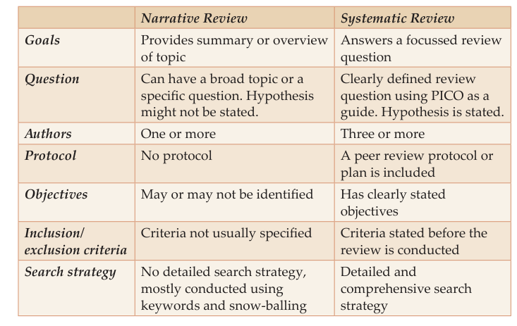
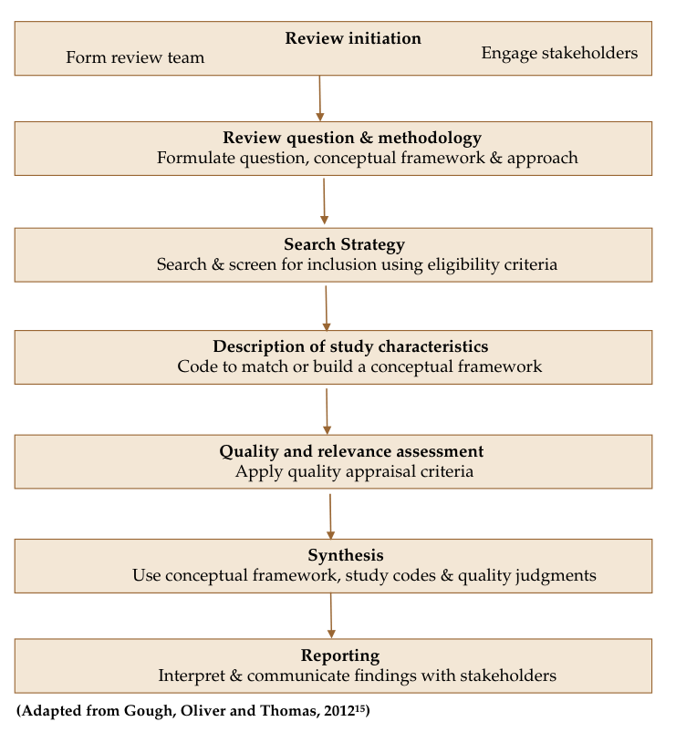
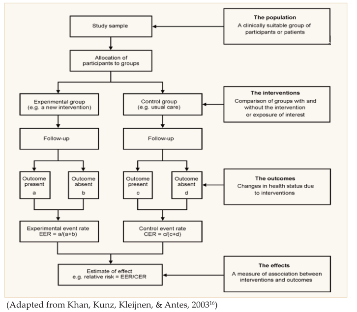
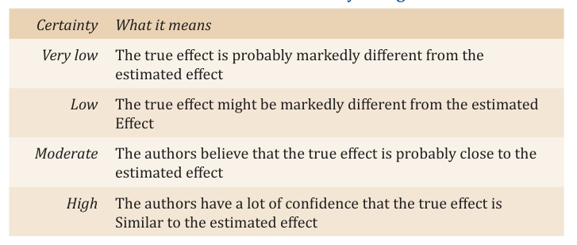
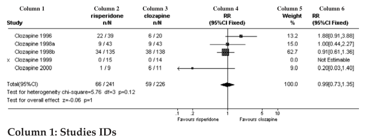
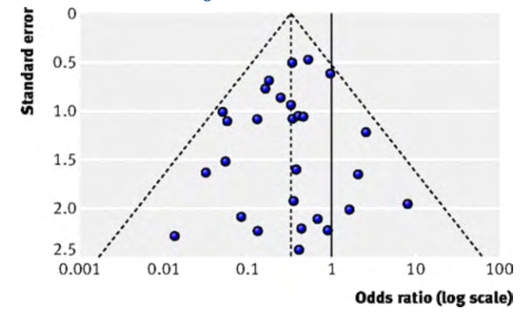
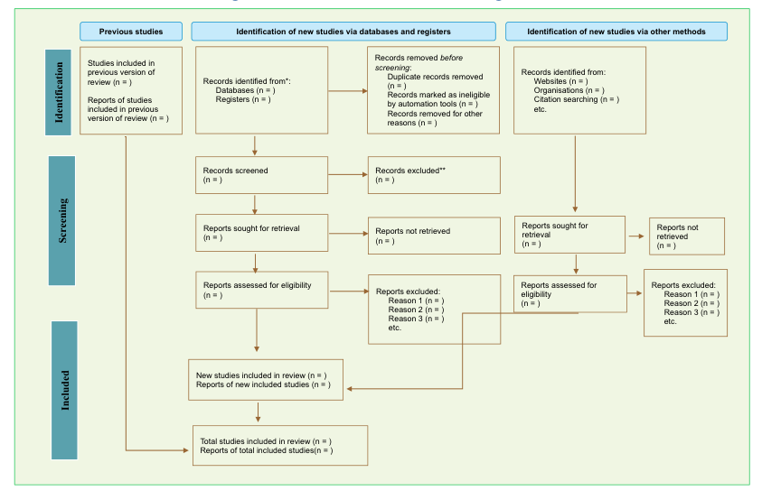

# Part 1: Foundations {background-color="#2c3e50" style="color: white;"}

## What is a Systematic Review?

> A review that uses **systematic and explicit methods** to identify, select, and critically appraise relevant research, and to synthesise findings.

::: {.incremental}
- Follows a **pre-defined protocol** -- decisions are not arbitrary
- Aims to **minimise bias** at every stage
- May or may not include a **meta-analysis** (statistical pooling)
- Considered the **highest level** of evidence
:::

::: {.notes}
Key distinction: Meta-analysis = statistical synthesis only. It may or may not be part of a systematic review.
:::

## Why Do We Need Systematic Reviews?

::: {.incremental}
- **Stay current** with the flood of new research
- **Identify** better treatments and **retire** outdated ones
- **Draft evidence-based guidelines** for health interventions
- **Resolve conflicts** where studies report different results
- **Inform policy** with transparent, reproducible evidence
:::

## Narrative Review vs Systematic Review

{fig-align="center" height="520"}

::: {.notes}
Key contrasts: broad vs focused question, no protocol vs registered protocol, subjective vs explicit selection, 1+ author vs 3+ authors, weeks vs months-years timeline.
:::

# Part 2: Steps in a Systematic Review {background-color="#2c3e50" style="color: white;"}

## Overview of the SR Process

{fig-align="center" height="520"}

::: {.notes}
Walk through each stage: Review initiation, Question & methodology, Search strategy, Study characteristics, Quality assessment, Synthesis, Reporting.
:::

## Getting Started

:::: {.columns}

::: {.column width="50%"}
### Your Review Team
- Clinical / subject expert
- SR methods expert
- Statistician
- Librarian / information specialist
:::

::: {.column width="50%"}
### Before You Start
- Check for **existing reviews** (Cochrane, PROSPERO)
- Write and register a **protocol**
- Agree on **timelines** (aim: ~1 year)
- Choose **software** for each stage
:::

::::

## Step 1: Ask a Focused Question (PICO)

{fig-align="center" height="520"}

::: {.notes}
The question drives EVERY subsequent step: search terms, inclusion criteria, data extraction, synthesis.
:::

## The PICO Framework

| | What it means | Example |
|---|---|---|
| **P** -- Population | Who are the patients / participants? | Women with domestic violence |
| **I** -- Intervention | What treatment / exposure? | Advocacy programmes |
| **C** -- Comparator | Compared to what? | Standard care |
| **O** -- Outcome | What do we measure? | Quality of life |

. . .

**Tip:** Your PICO directly becomes your review title, search terms, and inclusion criteria.

## Step 2: Search for Studies

:::: {.columns}

::: {.column width="50%"}
### Build Your Search String
1. List **keywords** for each PICO element
2. Add **synonyms** and MeSH terms
3. Combine with **Boolean operators**
   - **OR** within elements (broadens)
   - **AND** across elements (narrows)
:::

::: {.column width="50%"}
### Where to Search
- **PubMed / MEDLINE** (biomedical)
- **Cochrane Library** (trials & reviews)
- **EMBASE** (pharma, devices)
- **Google Scholar** (grey literature)
- **CTRI / ClinicalTrials.gov** (trials)
:::

::::

## Step 3: Screen & Select Studies

### Two-stage process (always done by two reviewers independently)

. . .

**Stage 1 -- Title & Abstract:** Remove clearly irrelevant hits

. . .

**Stage 2 -- Full Text:** Apply inclusion / exclusion criteria

. . .

### Tools to Help

- **Rayyan** (free) or **Covidence** for screening
- **Zotero** or **EndNote** for reference management
- Record everything for the **PRISMA flow diagram**

## Step 4: Extract Data & Appraise Quality

:::: {.columns}

::: {.column width="50%"}
### Data Extraction
- Use a **standardised form**
- Extract: study design, population, intervention, outcomes, results
- Two reviewers extract **independently**
- Contact authors for **missing data**
:::

::: {.column width="50%"}
### Risk of Bias Assessment
- Was randomisation done properly?
- Were participants / assessors blinded?
- Was follow-up complete?
- Were all outcomes reported?

Each domain rated: **Low**, **High**, or **Unclear** risk
:::

::::

# Part 3: Quality of Evidence {background-color="#2c3e50" style="color: white;"}

## GRADE: How Confident Are We?

{fig-align="center" height="520"}

::: {.notes}
GRADE = Grading of Recommendations, Assessment, Development and Evaluations. RCT evidence starts HIGH, observational starts LOW.
:::

## GRADE in a Nutshell

| Certainty | What it means |
|-----------|---------------|
| **High** | We are very confident in the effect estimate |
| **Moderate** | True effect is probably close, but could differ |
| **Low** | True effect may be substantially different |
| **Very Low** | We have very little confidence |

. . .

### Five reasons to downgrade

**R**isk of bias, **I**nconsistency, **I**ndirectness, **I**mprecision, **P**ublication bias

# Part 4: Meta-Analysis {background-color="#2c3e50" style="color: white;"}

## What is Meta-Analysis?

> A statistical method that **combines results from multiple studies** to produce a single pooled effect estimate.

::: {.incremental}
- Increases **statistical power** by combining small studies
- Improves **precision** of the overall estimate
- Quantifies **variability** between studies (heterogeneity)
- Not every SR needs one -- only when studies are **sufficiently similar**
:::

## Common Effect Measures {.smaller}

:::: {.columns}

::: {.column width="50%"}
### For Yes/No Outcomes
(e.g., died vs survived)

- **Risk Ratio (RR)**
- **Odds Ratio (OR)**
- **Risk Difference (RD)**
:::

::: {.column width="50%"}
### For Continuous Outcomes
(e.g., blood pressure, weight)

- **Mean Difference (MD)**
- **Standardised Mean Difference (SMD)**
:::

::::

. . .

All reported with a **95% Confidence Interval** -- if the CI crosses 1 (for RR/OR) or 0 (for MD), the result is **not statistically significant**.

## Heterogeneity: Why Do Studies Differ?

::: {.incremental}
- Different **populations** (age, severity, setting)
- Different **interventions** (dose, duration)
- Different **study designs** or quality
- Different **outcome measures**
:::

. . .

### The I^2^ Statistic

Tells you what **percentage of variation** is due to real differences (not chance):

| I^2^ | Interpretation |
|-------|---------------|
| 0--40% | Probably not important |
| 30--60% | Moderate heterogeneity |
| 50--90% | Substantial heterogeneity |
| 75--100% | Considerable heterogeneity |

## Fixed vs Random Effects

:::: {.columns}

::: {.column width="50%"}
### Fixed Effects Model
- Assumes **one true effect** in all studies
- Best when studies are **very similar**
- Gives more weight to **larger studies**
:::

::: {.column width="50%"}
### Random Effects Model
- Assumes the true effect **varies** across studies
- Best when there is **some heterogeneity**
- Gives relatively more weight to **smaller studies**
- Produces **wider** confidence intervals
:::

::::

## The Forest Plot

{fig-align="center" height="520"}

::: {.notes}
Walk through: study IDs, event counts, graphical display (boxes = studies, diamond = pooled), weight column, numerical results. Vertical line = no effect.
:::

## Reading a Forest Plot

{fig-align="center" height="300"}

- **Boxes** = individual study results (bigger box = more weight)
- **Whiskers** = 95% confidence interval
- **Diamond** = pooled (combined) result
- **Vertical line** = no difference between groups
- If the diamond **does not touch** the line: result is **statistically significant**

## The Funnel Plot

{fig-align="center" height="520"}

::: {.notes}
Symmetric funnel = no publication bias. Asymmetry suggests small studies with negative results may be missing. Formal tests: Egger's test.
:::

# Part 5: Reporting {background-color="#2c3e50" style="color: white;"}

## PRISMA 2020 Flow Diagram

{fig-align="center" height="520"}

::: {.notes}
PRISMA 2020 updated the original 2009 version. Shows exactly how many records were identified, screened, excluded, and included.
:::

## Reporting & Dissemination

### Reporting Guidelines

| Guideline | Use For |
|-----------|---------|
| **PRISMA 2020** | Systematic reviews of interventions |
| **MOOSE** | Meta-analyses of observational studies |
| **PRISMA-P** | Systematic review protocols |

. . .

### Sharing Your Findings

- **Summary of Findings table** (GRADE) -- for clinicians
- **Plain Language Summary** -- for non-specialists and patients
- **Policy Brief** -- for decision-makers (2--4 pages)

# Part 6: Tools & Resources {background-color="#2c3e50" style="color: white;"}

## Useful Software (Free Options)

| Stage | Tool |
|-------|------|
| Reference management | **Zotero** |
| Screening | **Rayyan** |
| Data extraction | **MS Excel** (with template) |
| Meta-analysis | **RevMan** (Cochrane) or **R** |
| GRADE assessment | **GRADEpro GDT** |
| Reporting | **PRISMA flow diagram generator** |

## Where to Learn More

- **Cochrane Handbook** -- the gold standard reference
- **Cochrane Training** -- free online courses
- **PROSPERO** -- register your protocol here
- **EQUATOR Network** -- find the right reporting guideline
- **GRADE Working Group** -- certainty of evidence resources
- **Systematic Review Toolbox** -- systematicreviewtools.com

# Summary {background-color="#2c3e50" style="color: white;"}

## Key Takeaways

::: {.incremental}
1. An SR follows a **pre-defined protocol** to minimise bias
2. **PICO** structures your question and drives every step
3. Search **comprehensively** across multiple databases
4. Use **two independent reviewers** at every stage
5. **GRADE** tells you how confident to be in the evidence
6. **Meta-analysis** pools results statistically -- but only when appropriate
7. Report using **PRISMA 2020**
:::

## Thank You {.center}

### References

- Sinha A, Menon GR, John D. *Beginner's Guide for Systematic Reviews.* ICMR.
- Cochrane Handbook for Systematic Reviews of Interventions (v6.3)
- Page MJ et al. PRISMA 2020. *BMJ* 2021;372:n71
- GRADE Working Group. gradeworkinggroup.org

::: {.notes}
Suggest participants try: formulate a PICO question in their area of interest and identify 3 databases to search.
:::
